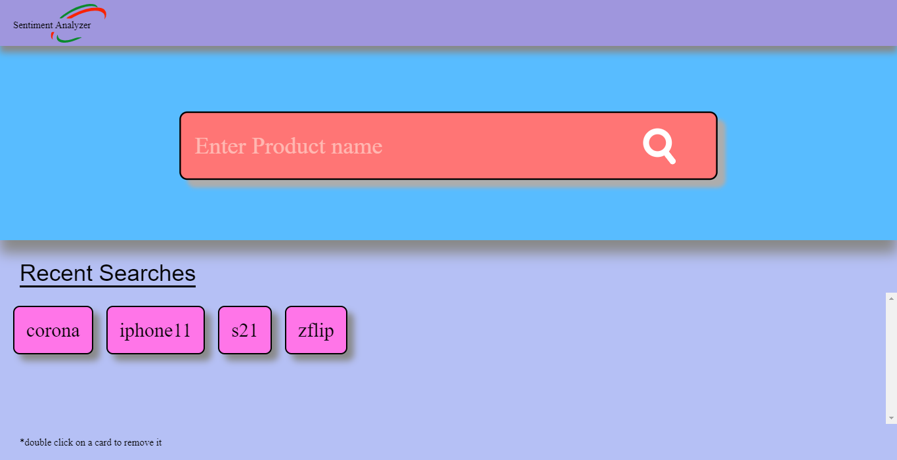
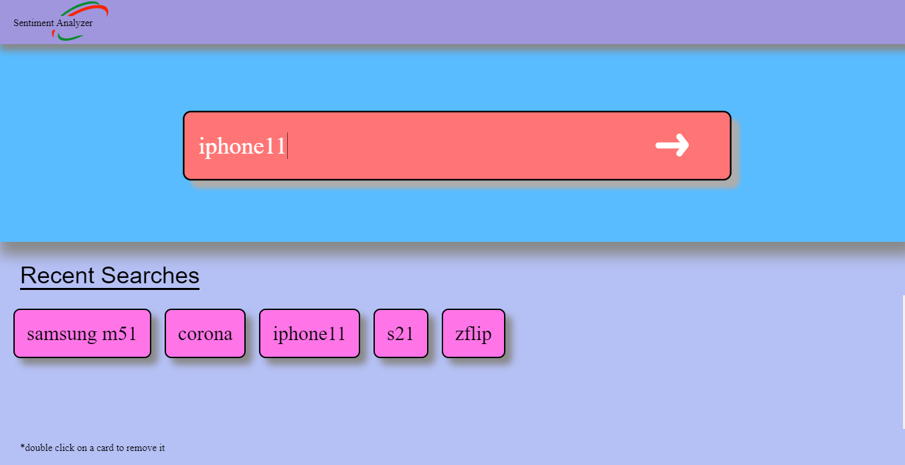
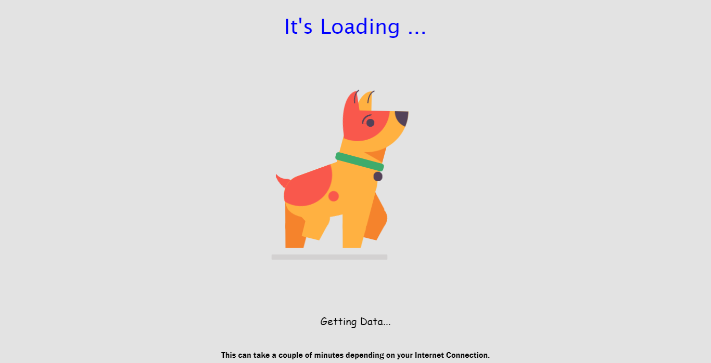
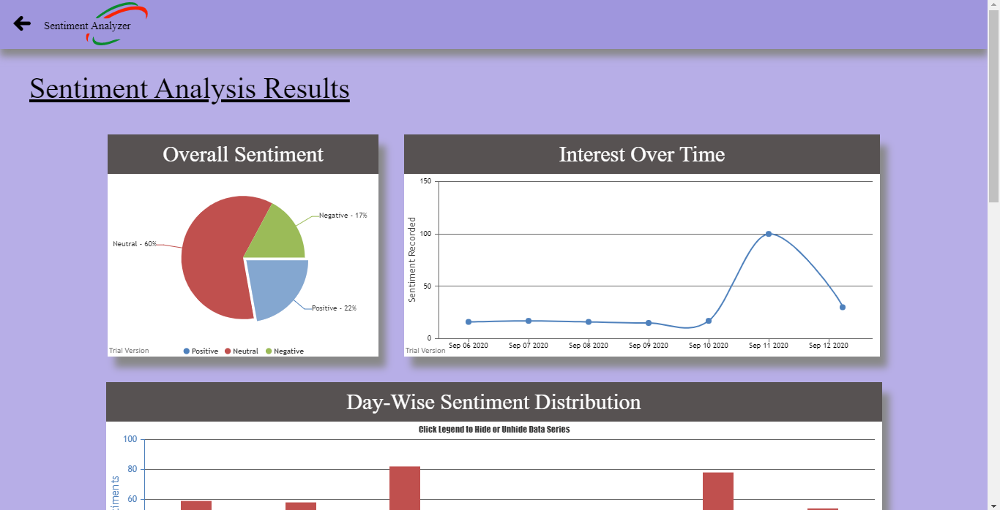
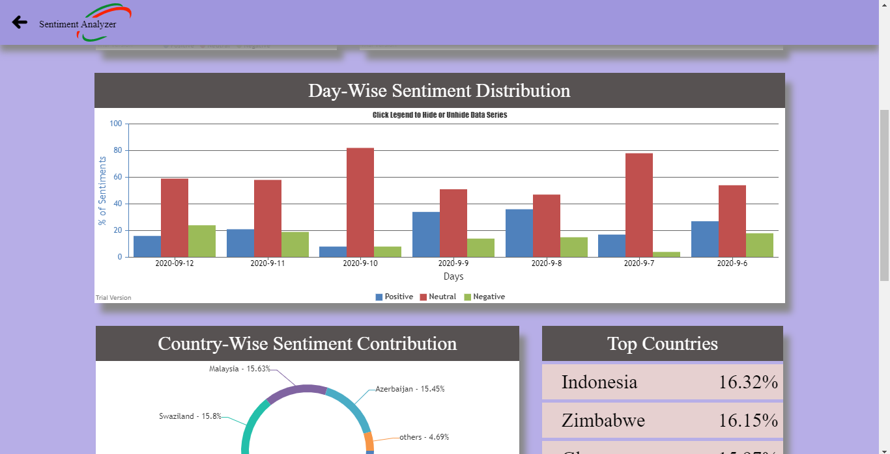
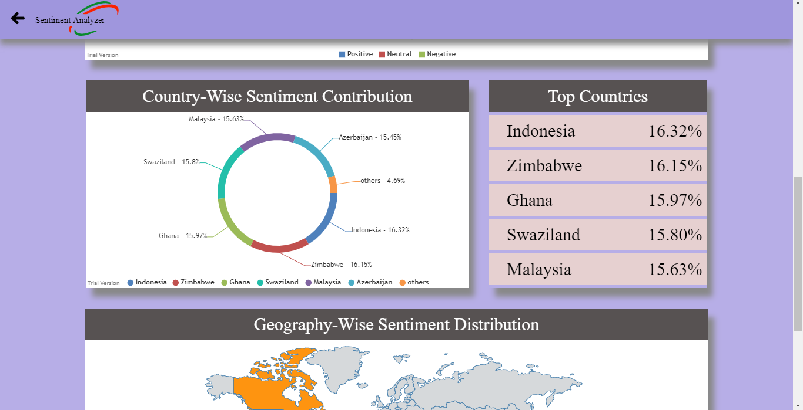
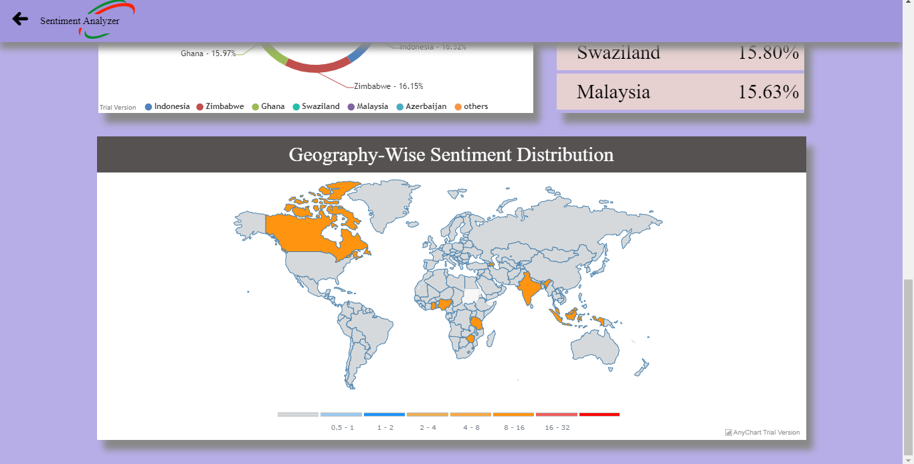

# Sentiment-Analyzer

This was developed for a hackathon. The Problem stated to develop a desktop app, which can scrap tweets from twitter, analyse the sentiment of it, and represent the results in a geographical manner.

This is a desktop-app built using electon framework. Front-end is made using HTML/CSS, BootStrap, and the back-end is handled with python. Pyshell is used to connect both frontend and backend, and electron framework is used here to give this a structure of desktop app.

The working of this sentiment-analyzer is as follows:

-   Python's Part

    -   Tweepy library is used for extracting the tweets.

    -   Threading is used here to fasten the proces, each thread independently scrap the twitter, so that, maximum tweets can be scraped in less time.

    -   Tweets are cleaned and filtered, and finally passed through TextBlob library's sentiment analyzer, to get the polarity of the tweets.

    -   This polarity details is stored in a json file.

-   JavaScript's Part

    -   Used to get input from the user, and pass it to the python code, to get polarity details in form of a json file.

    -   Now we access the json file which has the polarity details, and pass it through various charts and graphs provided by CanvasJs.

    -   And we finally display the results.

For running this app, you can clone it and use npm install to install the node dependencies, and use pip to install TextBlob and tweepy. You also need to get developer account of twitter to get the api key. Place the api keys, in token.py file under Tweet_Extracter Folder and you are good to go.

Some Screenshots of this desktop app:

